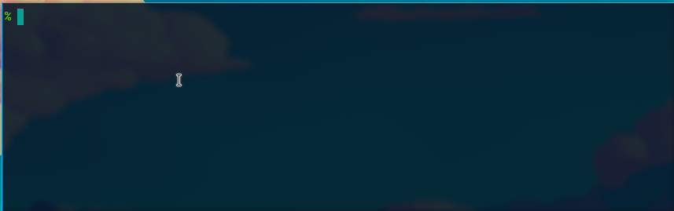

# Tea

Linux command-line utility to display short timer notifications



## Synopsis

```sh
# Brew tea for three minutes
tea 3:00

# Other time formats are supported as well
tea 45
tea 1:00:00
tea 3m 25s
tea 3min 25sec

# List or stop ongoing timers
tea --list
tea --stop

# See help for full details
tea (-h|--help|--man)
```

## Description

The script schedules a timer. The progress is displayed on a notification
using a progress bar.

The ongoing timer can be stopped via D-Bus.

## Dependencies

* Perl 5.38 or newer
* Perl modules
  - `IPC::System::Simple`
  - `Net::DBus`
  - `XML::Twig`
  - `AnyEvent`
  - `AnyEvent::DBus`
* `notify-send(1)` and a notification daemon of your choice

## Configuration

### Dunst

The script does not assume any concrete notification daemon. However, if you
want to get an appearance similar to what is displayed in the animation above,
you can use [Dunst](https://dunst-project.org/) with the following
configuration:

```ini
[global]
    width = 480
    height = 300

    progress_bar = true
    progress_bar_height = 6

    # Also works nicely with the following set to 0.
    progress_bar_frame_width = 1

    progress_bar_min_width = 450
    progress_bar_max_width = 480
    transparency = 4
    horizontal_padding = 8
    corner_radius = 5

    frame_width = 1
    frame_color = "#5080fb"
    font = Victor Mono 10

    markup = full
    alignment = left
    ignore_newline = no
    min_icon_size = 32
    max_icon_size = 32

    # Set path to icons providing mug or cup icons. The animation uses
    # Newaita-Dark (https://github.com/cbrnix/Newaita/) icons.
    # icon_path = ...

[tea-brew]
    appname = tea
    msg_urgency = low

    format = "<b>%s</b>\n%b"
    default_icon = caffeine-cup-empty

[tea-abort]
    appname = tea
    msg_urgency = normal

    format = "<b>%s</b>\n%b"
    default_icon = caffeine-cup-empty

[tea]
    appname = tea
    msg_urgency = critical

    background = "#73ea87"
    foreground = "#052516"
    frame_color = "#052516"
    timeout = 0

    format = "<b>%s</b>\n%b"
    default_icon = caffeine-cup-full
```
